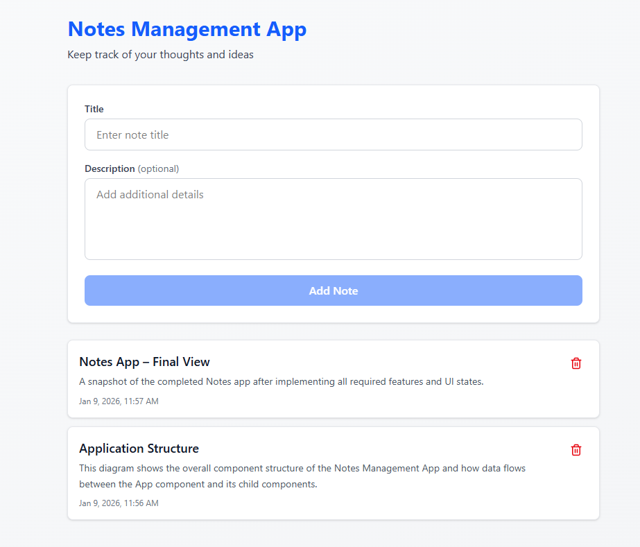

# 📝 Notes Management App

A simple Notes Management application built using **React** and **Vite**. 
The app allows users to ➕ add, 👀 view, and ❌ delete notes while handling ⏳ loading, 📭 empty, and ⚠️ validation states in a clear and predictable way. 🎨 Tailwind CSS is used for styling, and 🧩 lucide-react is used for icons.

---
## 🖼️ Application Preview
Below is the final user interface of the Notes Management App.



---
##  🧰 Prerequisites :
Make sure you have the following installed on your system:
```bash
Node.js (version 18 or higher recommended)
npm (comes with Node.js)
```
You can check your versions using:
```bash
node -v
npm -v
 ```
---
## 📦 Installation : 
Follow the steps below to set up and run the project locally.

#### Step 1: Clone the repository :
 Clone the project from GitHub to your local machine:
```bash
git clone https://github.com/Shivam-RN/CodeTikki-Assignment.git
```
#### Step 2: Navigate to the project folder :
```bash
cd CodeTikki-Assignment
```
#### Step 3: Install dependencies :

Install all required project dependencies :
```bash
npm install
```
This will install React, Vite, Tailwind CSS, lucide-react, and other required packages.

#### Step 4: Start the development server :

Run the application in development mode:
```bash
npm run dev
```
#### Step 5: Open in browser :
 
Once the server starts, open your browser and visit:
```bash
http://localhost:5173
```
The app will automatically reload when you make changes to the code.

---
## 📂 Project Structure
The project follows a clean and organized React + Vite folder structure:

```bash
codetikiki-assignment/
├── node_modules/            #  Project dependencies
├── public/                  #  Public assets
├── src/                     #  Application source code
│   ├── assets/              #  Static assets (images, diagrams)
│   ├── components/          #  Reusable React components
│   │   ├── EmptyState.jsx   #  Empty state message component
│   │   ├── Loader.jsx       #  Loading spinner component
│   │   ├── NoteForm.jsx     #  Add note form with validation
│   │   ├── NoteItem.jsx     #  Individual note with delete action
│   │   └── NoteList.jsx     #  Notes list renderer
│   ├── App.jsx              #  Main application component
│   ├── main.jsx             #  Application entry point
│   └── index.css            #  Global styles (Tailwind CSS)
├── index.html               #  HTML entry file
├── .gitignore               #  Git ignored files
├── eslint.config.js         #  ESLint configuration
├── vite.config.js           #  Vite configuration
├── package.json             #  Project metadata and scripts
├── package-lock.json        #  Dependency lock file
└── README.md                #  Project documentation
```
---
## 🧩 Component Breakdown

#### 🧠 App :
 Acts as the main container and holds all application state. Controls data flow and UI state handling.

#### ✏️ NoteForm :
 Handles creating new notes and validating user input. The title field is required and shows inline error messages.

#### 📋 NoteList :
 Renders the list of all notes and passes delete functionality to each note item.

#### 🗒️ NoteItem :
 Displays a single note with its title, description, timestamp, and delete button. Uses lucide-react icons.

#### ⏳ Loader :
 Displays a loading indicator during the initial load to simulate an API call.

#### 📭 EmptyState :
Shows a friendly message when no notes are available after loading.

---
## 🧠 State Management

All data is stored and managed using React’s built-in state management.
The notes state lives in the App component as the single source of truth.
Data flows ⬇️ from parent to child via props, and updates are sent ⬆️ using callback functions.

---
## 🎯 UI States Handled

⏳ Loading State – Displays a loader for 1–2 seconds on initial load.

📭 Empty State – Shows a message when no notes are available.

⚠️ Error State – Displays inline validation error if the title field is empty.

---
## ⚠️ Assumptions / Limitations

🔄 Notes are stored only in React state and do not persist after page reload.

🗄️ No backend, database, or localStorage is used.

🎨 Tailwind CSS is used for simple and consistent styling.

🧩 lucide-react is used only for icons and does not affect application logic.
